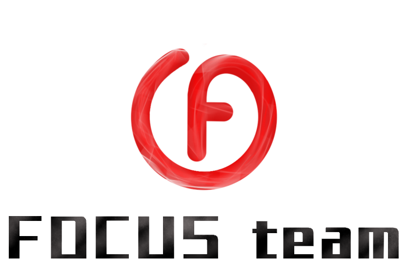

团队是 **FOCUS team**：

FOCUS team成立于2018年，来自重庆邮电大学，以“ **F** - Friendly友爱、**O** - Optimistic乐观、**C** - Cooperation合作、**U** - Unique独特、**S** - Smart明智 ”为核心理念，为丰富学生的“大学生活和学习途径”为愿景，提供“良好学习环境、全方位服务、优势资源支持”，优先满足学生的学习需求，让学生“学有所思、学有所悟、学有所获、学有所成”为目标。我们现有LearningYard学苑公众号、LightHouse智能驿站、ExpressSimulation递仿、EasyEdu易尚学、KeyIntell玥慧咨询、BookShare书享、Agorin农订等项目，与伙伴开放合作，持续为学生创造价值，释放个人潜能，丰富学生生活，激发组织创新。FOCUS team坚持以“分享兴趣，传播快乐，增长见闻，留下美好”为宗旨，光阴易逝，年华易老，趁着年少努力学习，不浪费一寸光阴！
